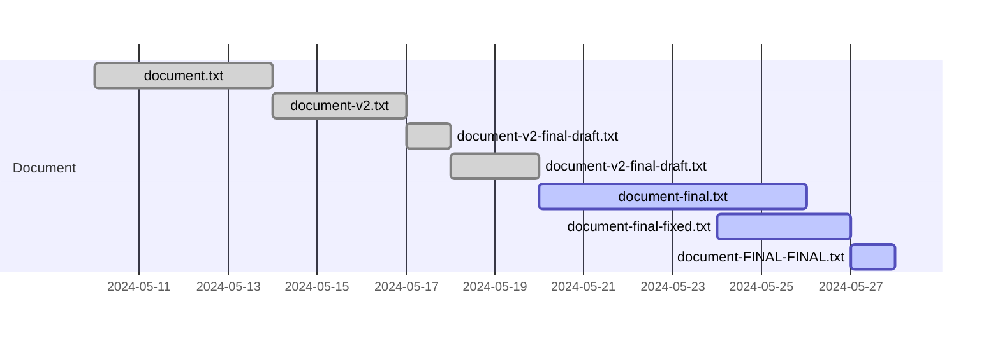

## 1. Why Version Control?

In any collaborative project, whether you're developing software, writing a book, or working on research papers, managing changes and tracking progress is crucial. As projects grow in size and complexity, keeping track of every modification, suggestion, and version manually becomes impractical and chaotic. This is where a Version Control System (VCS) comes into play.

A VCS is a tool that helps manage changes to documents, programs, and other information stored as computer files. It provides a structured way to track and merge changes from multiple contributors, ensuring that everyone is working on the most up-to-date version of the project. Additionally, a VCS allows you to revert to previous versions, compare different iterations, and maintain a clear history of project evolution.

Using a VCS streamlines collaboration, reduces the risk of conflicts, and enhances productivity by providing a reliable system for managing versions. Whether you're working solo or in a team, a VCS is an indispensable tool for maintaining order and efficiency in your project. Let's explore why a VCS is essential by looking at common challenges in document iteration and the benefits of systematic version control.

### 1.1 Iterations of working documents

Imagine working on a document, starting with a file named `document.txt`. As you update the layout and make progress, you create new versions to avoid losing previous work. This leads to filenames like `document-v2.txt`.

Then, you share the file with a friend for feedback. After incorporating their suggestions, the file becomes `document-v2-final_draft.txt`. You send this version to another friend, resulting in `document-v2-final_draft2.txt`. Finally, you complete the document and name it `document-final.txt`. But before printing or publishing, you ask your mother to review it, leading to a file named `document-final-fixed.txt`. After addressing more feedback, you end up with `document-FINAL-FINAL.txt`.

Your project folder now looks like this:

```bash
my-project
├── document.txt
├── document-v2.txt
├── document-v2-final_draft.txt
├── document-v2-final_draft2.txt
├── document-final.txt
├── document-final-fixed.txt
└── document-FINAL-FINAL.txt
```

To make matters worse, these files might be active simultaneously, with different versions being edited at the same time:



Now, imagine this scenario for projects with multiple files, such as source code, books, or research papers.

In the early era of software development (1960s and 1970s), the need for a system to manage changes logically arose. The first Source Code Control System ([Source Code Control System](https://en.wikipedia.org/wiki/Source_Code_Control_System)) was developed in 1972. Over time, other version control systems (VCS) were developed, with Git being the most commonly used today.

### 1.2 What Is a Version Control System?

Consider books: they have different editions. When the content is updated, the edition number increases. This practice has been around for hundreds of years. Books are often written by a single author, and collaborative editing is labor-intensive. However, in software development, where code can be spread across thousands of lines, distinguishing between characters like lowercase ‘l’ and uppercase ‘I’ is crucial to prevent bugs.

This is where VCS comes into play. What should a VCS be able to do?

- Track changes across multiple files
- Compare different versions
- Restore a previous state
- Facilitate collaboration with others

The evolution of VCS reflects the changing needs of developers:

- [RCS](https://www.gnu.org/software/rcs/) (1982)
- [CVS](http://cvs.nongnu.org/) (1990)
- [SVN](https://subversion.apache.org/) (2000)
- [Mercurial](https://www.mercurial-scm.org/) (2005)
- [Git](https://git-scm.com/) (2005)

Git, created in 2005, has become the most widely used VCS due to its flexibility, efficiency, and powerful features for managing projects of any scale.
