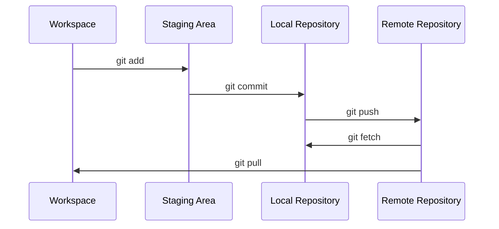

# 3. What is GitHub?

GitHub is a platform that extends Git’s capabilities, making collaboration and project management more accessible and efficient. While Git itself provides robust version control, coordinating contributions and maintaining a streamlined workflow can be cumbersome. GitHub, along with similar platforms like GitLab, Bitbucket, and Gitea, simplifies these processes by offering a range of additional features.

There are many services that offer additional functionality around Git. One of the biggest is GitHub, which is now part of Microsoft. The features that this service offers go beyond the capabilities of Git. You can create a wiki, issues, discussions, project management and automation on GitHub. The service is also focused on collaboration on repositories.

## 3.1 Beyond Git: Enhanced Collaboration and Project Management

Git allows collaboration through commands like git format-patch and git am, but these methods can be cumbersome. To address this, platforms like GitHub were developed, offering features far beyond the capabilities of Git alone. These platforms provide tools for:

- **Project Management**: Integrated issue tracking, project boards, and milestones help manage tasks and timelines.
- **Collaboration**: Pull requests, code reviews, and discussion threads streamline team communication.
- **Documentation**: Wikis and Markdown support make it easy to create and maintain project documentation.
- **Automation**: Continuous integration and deployment pipelines, along with other automation tools, enhance workflow efficiency.
- **Community Engagement**: Discussions, stars, and social features foster community involvement and recognition.

## 3.2 Working with Remotes
 
To effectively manage and collaborate on your projects, you need to understand how to work with remote repositories. Git provides several commands for this purpose:

- **Cloning a Repository**: `git clone <repository_url>` downloads a repository from a remote server to your local machine.
- **Fetching Updates**: `git fetch` updates your local repository with changes from the remote repository without altering your working directory.
- **Pulling Changes**: `git pull` fetches changes from the remote repository and updates your working directory.
- **Pushing Changes**: `git push` uploads your commits from the local repository to the remote repository.

These commands facilitate seamless collaboration and ensure your local and remote repositories stay synchronized.

GitHub, with its extensive features and intuitive interface, has become an essential tool for developers worldwide. It simplifies collaboration, enhances project management, and integrates seamlessly with Git, making it easier to handle even the most complex development projects.
