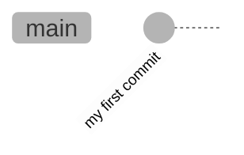
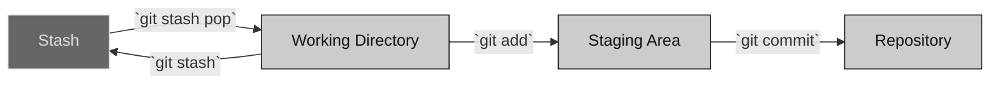

# 4. Basic Git Commands

In this chapter, we will cover the essential Git commands that you need to start working with a repository. These commands will help you initialize a repository, check its status, add changes, and commit those changes.

## 4.1 Project Initialization

Before using most Git commands, you must initialize a Git repository in your project directory. This sets up Git to track changes in that directory. To do this, use the following command:

```bash
git init -b main
```

### Command Breakdown:
- **`git init`**: This command initializes a new Git repository. When you run this command, Git creates a hidden directory named `.git` in your project directory. This directory contains all the necessary files for Git to track your project’s history and manage your versions.
- **`-b main`**: This option specifies the initial branch name for the repository. By default, Git names the initial branch `main`, which is a common convention. The `-b` flag is short for `--initial-branch`, allowing you to specify the branch name at initialization.

After running this command, you will have a Git repository set up and ready to start tracking changes. It's important not to delete the `.git` directory, as it contains the entire history and configuration of your project.

## 4.2 Checking Repository Status

The `git status` command is one of the most frequently used Git commands. It provides you with a detailed overview of the current state of your working directory and staging area.

```bash
git status
```

### Command Breakdown:
- **`git status`**: This command shows the status of changes as untracked, modified, or staged. It helps you understand which changes have been made, which changes are ready to be committed, and which changes have not yet been added to the staging area.

For a freshly initialized repository, the output will look something like this:

```bash
On branch main

No commits yet

nothing to commit (create/copy files and use "git add" to track)
```

- **"On branch main"**: Indicates the current branch you are working on. In this case, it's the main branch.
- **"No commits yet"**: Shows that no changes have been committed to the repository yet. This is typical for a new repository.
- **"nothing to commit"**: Indicates there are no changes to commit at the moment. This means your working directory is clean.

## 4.3 Adding Changes to the Staging Area

Before committing changes, you need to add them to the staging area. The staging area, also known as the index, is a place where Git collects changes that will be part of the next commit.

### Example:
To add a file named `README.md` to the staging area:

1. First, create the file and add some content to it.
2. Use the `git add` command to stage the changes.

```bash
git add README.md
```

### Command Breakdown:
- **`git add <filename>`**: This command adds changes to the staging area. The `filename` argument specifies the file you want to add. In this example, `README.md` is added to the staging area. You can also use patterns like `git add .` to add all changes in the current directory.

Running `git add README.md` stages the changes made to the `README.md` file, preparing them to be included in the next commit. You can run this command multiple times to stage changes from multiple files.

## 4.4 Committing Changes

Once changes are staged, you can commit them. A commit in Git is like a snapshot of your repository at a specific point in time. It records the current state of the project and provides a reference point to which you can return if needed.

```bash
git commit -m "Add README file"
```

### Command Breakdown:
- **`git commit`**: This command records changes to the repository. When you commit, Git takes the changes in the staging area and saves them in the repository, creating a new commit with a unique identifier.
- **`-m "Commit message"`**: The `-m` option allows you to include a commit message that describes the changes. This message is important as it helps others (and your future self) understand what changes were made in that commit.

### Example:
After making changes to `README.md` and adding them to the staging area with `git add`, you finalize the changes with:

```bash
git commit -m "Add README file"
```

This creates a new commit with the message "Add README file". Each commit has a unique 40-character identifier (SHA-1 hash), which allows you to track and reference the commit.

## 4.5 Visualizing Commits

Commits build on each other, creating a chain of changes that represent the history of your project. Visualizing this chain can help you understand how your project has evolved over time. Here's a simple visualization using a mermaid diagram:



Each bubble in the graph represents a commit. As you make more commits, new bubbles will appear, each one building on the previous ones. This structure shows how commits are interconnected, with each commit depending on the ones before it.

## 4.6 Understanding Workspaces

When working with Git, you will encounter terms like _working directory_, _staging area_, and _repository_. Here's an explanation of these terms and how they interact:



### Definitions:
- **Working Directory**: This is the directory on your file system where you make changes to your files. Git monitors this directory but does not save changes until you explicitly tell it to.
- **Staging Area**: Also known as the index, this is where you place changes that you want to include in the next commit. You add changes to the staging area using the `git add` command.
- **Repository**: This is where Git stores the history of your project, including all commits and changes. It is organized within the `.git` directory created when you initialize the repository.

### Special Command - Stash:
The `git stash` command allows you to temporarily save changes that are not ready to be committed. This is useful when you need to switch branches or work on something else without committing incomplete changes.

- **`git stash`**: Saves the current state of your working directory and staging area.
- **`git stash pop`**: Applies the stashed changes back to your working directory.

## 4.7 Summary of Basic Commands

- **`git init -b main`**: Initialize a new repository with the main branch.
- **`git status`**: Check the status of your repository, showing which changes are staged, unstaged, or untracked.
- **`git add <filename>`**: Add changes to the staging area, preparing them for a commit.
- **`git commit -m "Commit message"`**: Commit the staged changes, creating a new snapshot of your project with a descriptive message.

Understanding these basic Git commands is crucial for effectively managing your project’s version history. As you become more comfortable with these commands, you will be able to explore more advanced features and workflows in Git.