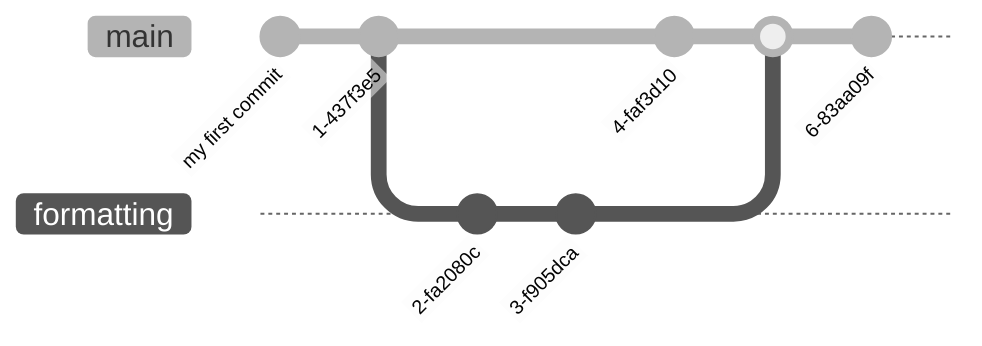

# 7. Branches and Merges

One of the main features of Git is the ability to create isolated workspaces, called branches, where you can develop new features, experiment with changes, or collaborate with others without affecting the main project. These branches can later be merged back into the main branch, integrating the changes.

## 7.1 Creating Branches

You start with the `main` branch and create your commits in that branch. If you decide you need another branch, the `git switch --create <new_branch>` command (introduced in Git version 2.23) creates a new branch from the current state of the branch you were in before and switches to it. Now you can make changes and commit them to this new branch, while your original branch remains unaffected. You can switch between branches at any time using `git switch <branch_name>`.


Typically, branches are used to work on a new feature for a piece of software, a new chapter or section of a book, or to experiment with different ideas. For instance, if you are working on an essay and want to try a different formatting, it makes sense to create a new branch just for those experiments. This way, you can keep your original work intact while working on something you are unsure about. Once you decide what to do with the experimental branch, you can either delete it using `git branch --delete <branch_name>` after switching to another branch, or merge its changes into the main branch.

## 7.2 Switching Branches

Switching between branches is straightforward with the `git switch <branch_name>` command. This allows you to change your current working branch to the specified branch. Make sure to commit or stash your changes before switching to avoid losing any work.

## 7.3 Merging Branches

When you conclude that you want to merge changes from another branch into the main branch, you use the `git merge` command.

Suppose you made some commits to the main branch before you created the _formatting_ branch, where you changed the formatting and applied some changes to the main branch as well. The Git graph would look something like this:


To merge the changes of the _formatting_ branch into the main branch, first switch to the main branch with `git switch main`, and then merge the changes from the _formatting_ branch using `git merge formatting`. The resulting graph looks like this:


If no changes in the main branch conflict with those in the branch being merged, Git simply appends the commits from the other branch. If there are conflicts, these must be resolved manually.

## 7.4 Resolving Merge Conflicts

When working on multiple branches, you might encounter merge conflicts if Git cannot automatically resolve which lines to keep or move. This typically happens when the same lines in a file are edited in different branches.

For example, if you are working on a book with each chapter in a separate branch, you may run into conflicts when merging chapters that overlap in the same sections of a file. If you merge a branch that results in a conflict, Git will alert you with a message like this:

```
Auto-merging <filename>
CONFLICT (content): Merge conflict in <filename>
Automatic merge failed; fix conflicts and then commit the result.
```

In the conflicting file(s), Git adds additional lines to indicate the conflict:

```
<<<<<< HEAD
This line was already within the main branch
======
This was added within the conflicting branch
>>>>>> conflicting_branch_name
```

- `<<<<<< HEAD` marks the beginning of the conflicting section from the current branch (HEAD).
- The text between `<<<<<< HEAD` and `======` is from the current branch.
- The text between `======` and `>>>>>> conflicting_branch_name` is from the conflicting branch.

To resolve the conflict:
- To discard changes from the current branch, delete everything from `<<<<<< HEAD` to `======`, including the markers.
- To discard changes from the conflicting branch, delete everything from `======` to `>>>>>> conflicting_branch_name`, including the markers.
- To merge or concatenate changes, manually edit the content as needed and remove all conflict markers.

After resolving the conflicts, stage the resolved files and commit them. Git creates a merge commit with the resolved changes.



## 7.5 Deleting Branches

After merging a branch and confirming that its changes are successfully integrated, you might want to clean up by deleting the branch. Use the `git branch --delete <branch_name>` command to delete a local branch. If you need to delete a remote branch, use the `git push origin --delete <branch_name>` command.

Cleaning up branches helps keep your repository organized and reduces clutter from branches that are no longer needed.
