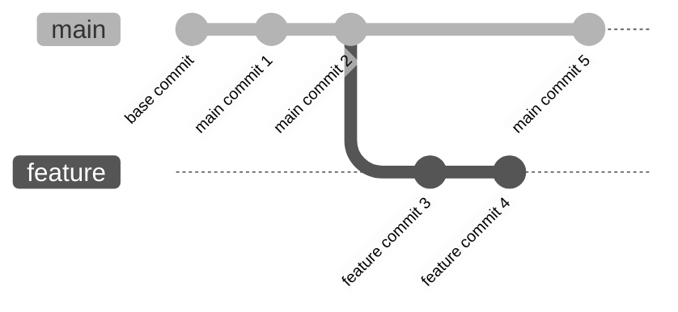
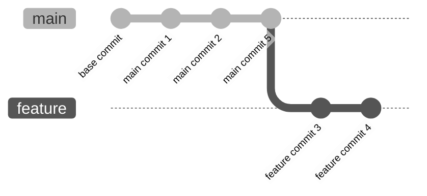

# 8. Rebasing and Squashing

Rebasing and squashing are powerful Git features that help you manage and clean up your commit history. They allow you to modify your commit history for better readability and organization, ensuring that your repository maintains a clean and understandable history.

## 8.1 Rebasing Commits

Rebasing is the process of moving or combining a sequence of commits to a new base commit. This can be useful when you want to incorporate changes from one branch into another, while maintaining a linear project history.



To rebase a branch, use the `git rebase <base_branch>` command. For example, if you have a feature branch that you want to rebase onto the main branch:

1. Switch to the feature branch:
    ```bash
    git switch feature_branch
    ```

2. Rebase onto the main branch:
    ```bash
    git rebase main
    ```

This effectively moves the commits from the feature branch to start after the latest commit on the main branch, providing a linear history.




## 8.2 Squashing Commits

Squashing commits is the process of combining multiple commits into a single commit. This is particularly useful when you have multiple small commits that can be logically grouped together to make the history cleaner and more understandable.

To squash commits, use the interactive rebase feature of Git:

1. Start an interactive rebase:
    ```bash
    git rebase -i HEAD~<number_of_commits>
    ```

2. In the text editor that opens, change the command from `pick` to `squash` (or `s`) for the commits you want to squash. The first commit should remain as `pick`.

3. Save and close the editor. Git will then prompt you to edit the commit message for the squashed commit.

This process will combine the selected commits into a single commit, reducing clutter in your commit history.

## 8.3 Interactive Rebasing

Interactive rebasing allows you to edit, reorder, and squash commits. It is initiated with the `-i` option in the `git rebase` command:

```bash
git rebase -i HEAD~<number_of_commits>
```

In the interactive rebase editor, you can perform several actions:

- `pick`: Use the commit as is.
- `reword`: Use the commit but edit the commit message.
- `edit`: Use the commit but stop for amending.
- `squash`: Combine this commit with the previous one.
- `fixup`: Similar to `squash` but discard the commit message.
- `exec`: Run a command (the rest of the line) using shell.
- `drop`: Remove the commit.

This provides a powerful way to clean up your commit history before merging it into the main branch.

## 8.4 Resolving Conflicts During Rebasing

Conflicts can occur during rebasing, just like during merging. When Git encounters a conflict, it stops and allows you to resolve it. After resolving the conflict, you need to continue the rebase process.

Steps to resolve conflicts during rebasing:

1. Identify and resolve the conflict manually in the conflicting files.
2. Stage the resolved changes:
    ```bash
    git add <resolved_file>
    ```

3. Continue the rebase process:
    ```bash
    git rebase --continue
    ```

If you want to abort the rebase process at any point, you can use:
```bash
git rebase --abort
```

## 8.5 Using Rebase to Clean Up Commit History

Rebasing is a powerful tool for cleaning up your commit history. By using interactive rebase, you can:

- Reorder commits to make the history more logical.
- Squash multiple small commits into a single commit.
- Edit commit messages to provide more meaningful descriptions.
- Remove unnecessary commits.

This is especially useful before merging a feature branch into the main branch. By cleaning up the commit history, you make it easier for others to understand the changes and the reasoning behind them.

### Example of Cleaning Up Commit History

Suppose you have the following commit history on your feature branch:

```bash
git log --oneline
```

```
abcd123 (HEAD -> feature) Commit 4
1234abcd Commit 3
5678efgh Commit 2
90ab12cd Commit 1
```

You want to squash commits 2, 3, and 4 into a single commit. Start an interactive rebase:

```bash
git rebase -i HEAD~4
```

In the editor, change the commands to:

```
pick 90ab12cd Commit 1
squash 5678efgh Commit 2
squash 1234abcd Commit 3
squash abcd123 Commit 4
```

Save and close the editor. Then, edit the commit message for the squashed commit. The result is a clean, single commit that encapsulates all the changes made in the feature branch.


Save and close the editor. Then, edit the commit message for the squashed commit. The result is a clean, single commit that encapsulates all the changes made in the feature branch.

## 8.6 Squash Merging

Squash merging is a way to combine all the commits from a feature branch into a single commit when merging into the main branch. This simplifies the commit history and makes it easier to understand the changes introduced by the feature branch.

To perform a squash merge:

1. Ensure you are on the main branch:
    ```bash
    git switch main
    ```

2. Execute the squash merge:
    ```bash
    git merge --squash feature_branch
    ```

3. Commit the squashed changes:
    ```bash
    git commit -m "Merged feature_branch with squash"
    ```

This process takes all the changes from the feature branch, combines them into a single commit, and merges that commit into the main branch.

### Example of Squash Merging

Suppose you have the following branches:

- `main` with commits `A`, `B`, and `C`
- `feature_branch` with commits `D`, `E`, and `F`

To squash merge `feature_branch` into `main`:

1. Switch to the main branch:
    ```bash
    git switch main
    ```

2. Squash merge the feature branch:
    ```bash
    git merge --squash feature_branch
    ```

3. Commit the squashed changes:
    ```bash
    git commit -m "Merged feature_branch with squash"
    ```

The resulting commit history will have `A`, `B`, `C`, and a new commit that combines `D`, `E`, and `F` into a single commit on the main branch.

## 8.7 Conclusion

By using rebasing and squashing effectively, you maintain a clean, understandable commit history that makes collaboration and code review easier.